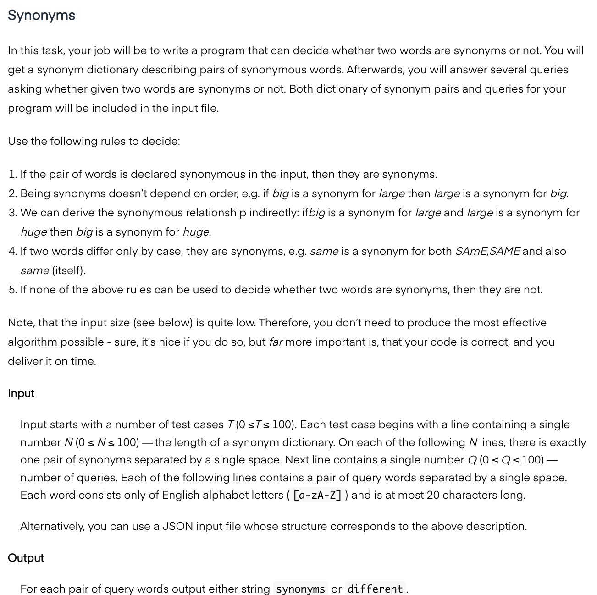
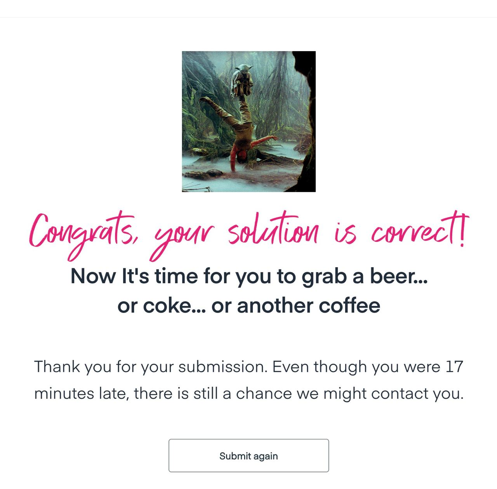

# Synonyms

Test task for [Vacuum Labs](https://vacuumlabs.com) company.

## Description

2 hours to submit `working code` and `resulting output` file

## How to Use

1. Copy input data (in JSON format) into `./input.json` file
2. Run `node ./index.js` script
3. Take output data (text result per line) from `./output.txt` file

## Samples of Input and Output

They provide several samples of input and output for the task. See `./data/` folder.

## Result

I've made 99% working a solution in one hour.

But fixing of all edge and corner cases takes more then next hour.

So correct result was submitted 17 minutes later than expected...

